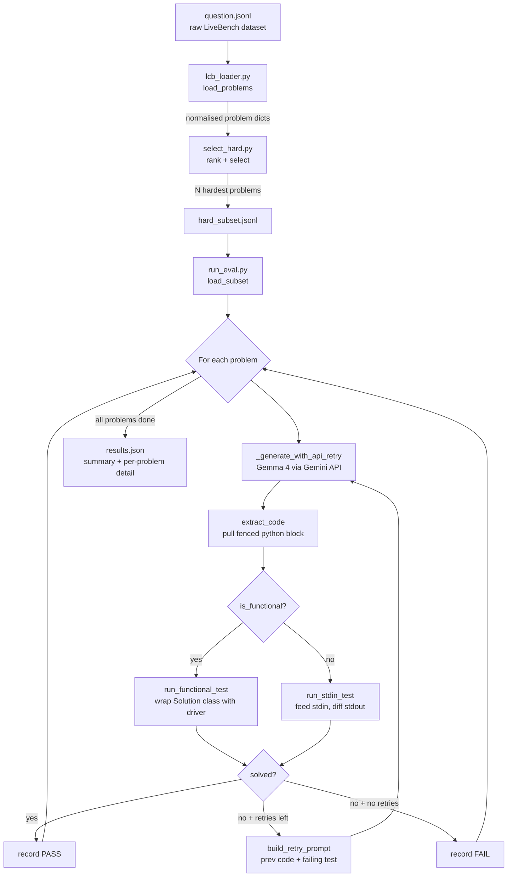

# Bootcamp Eval — LiveBench Code-Gen Harness

## What is this? (~100 words)

This is an evaluation harness for stress-testing a code-generation pipeline against
**hard** competitive programming problems from LiveBench's `LCB_generation` dataset
(LeetCode / AtCoder). It loads and normalizes the raw dataset, selects the N hardest
problems, sends each problem's prompt to **Gemma 4** via the Gemini API, extracts the
returned Python code, and runs it against every public + private test case in an
isolated subprocess. Failed attempts are retried with the error fed back to the model
(up to `--max-retries` times). Results are reported as PASS/FAIL per problem with an
overall score, and full detail is written to `results.json`.

## Files

| File | Purpose |
|---|---|
| `question.jsonl` | Raw LiveBench dataset |
| `lcb_loader.py` | Parses and normalizes the raw dataset into a flat dict per problem |
| `select_hard.py` | Ranks and picks the N hardest problems, writes `hard_subset.jsonl` |
| `run_eval.py` | Runs the generation + grading pipeline, writes `results.json` |
| `.env.example` | Template for environment variables (copy to `.env` and fill in) |
| `requirements.txt` | Python dependencies |

## Setup

```bash
# 1. Install dependencies
pip install -r requirements.txt

# 2. Configure API credentials
cp .env.example .env
# Fill in GEMINI_API_KEY in .env (get one at https://aistudio.google.com/apikey)
```

## Usage

```bash
# 1. Pick problems
python select_hard.py --n 5                     # top-5 hardest (deterministic)
python select_hard.py --n 5 --random            # random sample from hard pool
python select_hard.py --n 5 --random --seed 42  # reproducible random sample
python select_hard.py --n 8 --include-atcoder   # include AtCoder problems too

# 2. Run the eval
python run_eval.py                          # defaults: hard_subset.jsonl, 2 retries
python run_eval.py --timeout 10             # per-test timeout in seconds
python run_eval.py --max-tests 3            # cap tests/problem (quick smoke run)
python run_eval.py --max-retries 3          # retry failing problems up to 3 times
```

## Pipeline Flow



## Retry Mechanism

The harness has two independent retry layers:

| Layer | Trigger | Max attempts | Backoff |
|---|---|---|---|
| **API layer** (`_generate_with_api_retry`) | 500 / 503 / connection error | 3 | 5s, 15s |
| **Prompt layer** (main loop) | Test failure | `--max-retries` (default 2) | none |

On a prompt-layer retry, the failing test's `input`, `expected`, and `got` are appended to the prompt so the model can fix its mistake.

## Function Reference

### `lcb_loader.py`
| Function | Purpose |
|---|---|
| `load_problems(path)` | **Public API.** Reads the dataset JSONL and returns a list of normalized problem dicts (`question_id`, `title`, `platform`, `prompt`, `difficulty`, `fn_name`, `tests`, etc.). |
| `_decode_private(raw)` | Decodes private test cases: base64 → zlib → pickle → list. |
| `_decode_tests(raw)` | Decodes public test cases (plain JSON) or falls back to private decoding. |
| `_parse_original_json(q)` | Extracts the nested `original_json` field (sometimes a JSON string). |
| `_parse_metadata(oj)` | Extracts `metadata` (function name, etc.) from `original_json`. |
| `_extract_prompt(q, oj)` | Builds the full problem statement from `turns` or `question_content`. |

### `select_hard.py`
| Function | Purpose |
|---|---|
| `rank_key(p)` | Sort key: `hard` difficulty first, then by test count + prompt length. |
| `select(problems, n, include_atcoder, random_sample, seed)` | Filters and returns N problems; deterministic top-N or random sample depending on flags. |
| `write_subset(problems, path)` | Writes the chosen problems to a JSONL subset file. |
| `main()` | CLI entry point — wires args → `load_problems` → `select` → `write_subset`. |

### `run_eval.py`
| Function | Purpose |
|---|---|
| `generate(prompt)` | Calls Gemma 4 via Gemini API (reads `.env`). Swap body for `orchestrator.solve(prompt)` to plug in a custom solver. |
| `_generate_with_api_retry(prompt)` | Wraps `generate()` with up to 3 retries on transient API errors (500/503), with 5s and 15s backoff. |
| `build_retry_prompt(original, prev_code, first_failure)` | Builds a correction prompt from the original problem + previous code + first failing test. |
| `extract_code(text)` | Pulls the generated program out of a model reply (prefers the longest fenced python block). |
| `run_stdin_test(py, prog_path, test, timeout)` | Runs a stdin test: feeds input via stdin, compares whitespace-normalised stdout. |
| `run_functional_test(py, driver_path, test, exp_path, timeout)` | Runs a functional test: wraps the generated `Solution` class in a driver, compares the return value. |
| `evaluate_problem(p, code, timeout, max_tests)` | Runs all tests for one problem; solved only if **every** test passes. |
| `load_subset(path)` | Reads the JSONL subset produced by `select_hard.py`. |
| `main()` | CLI entry point — loads subset, runs retry loop per problem, prints PASS/FAIL, writes `results.json`. |

## Plugging in a Custom Orchestrator

To replace the default `generate()` with a custom solver, edit `run_eval.py`:

```python
def generate(prompt: str) -> str:
    import orchestrator
    return orchestrator.solve(prompt)  # must return a Python program as a string
```

## What's Still Missing

- **`orchestrator.py`** — the custom multi-model solver is planned but not yet implemented.
- **No automated tests** for the harness itself.
- **No CI / lint config** (no `.github/workflows`, no `pyproject.toml`).
