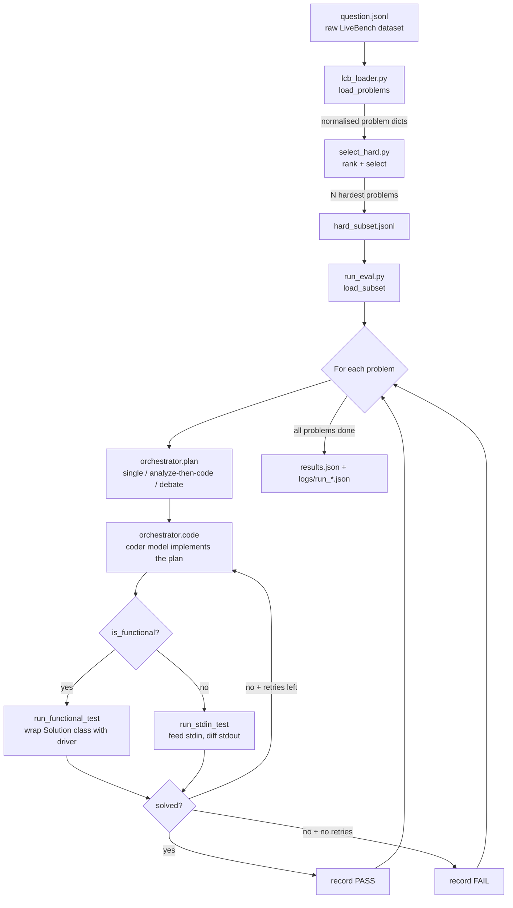

<a id="readme-top"></a>

# Bootcamp Eval — LiveBench Code-Gen Harness

An evaluation harness for stress-testing a multi-model, multi-strategy code-generation
pipeline against **hard** competitive programming problems.

<details>
  <summary>Table of Contents</summary>
  <ol>
    <li><a href="#about-the-project">About The Project</a>
      <ul><li><a href="#built-with">Built With</a></li></ul>
    </li>
    <li><a href="#getting-started">Getting Started</a>
      <ul>
        <li><a href="#prerequisites">Prerequisites</a></li>
        <li><a href="#installation">Installation</a></li>
      </ul>
    </li>
    <li><a href="#usage">Usage</a>
      <ul>
        <li><a href="#1-select-problems">1. Select problems</a></li>
        <li><a href="#2-run-the-eval">2. Run the eval</a></li>
        <li><a href="#model--strategy-configuration">Model &amp; Strategy Configuration</a></li>
        <li><a href="#pipeline-flow">Pipeline Flow</a></li>
        <li><a href="#retry-mechanism">Retry Mechanism</a></li>
        <li><a href="#detailed-logging">Detailed Logging</a></li>
      </ul>
    </li>
    <li><a href="#function-reference">Function Reference</a></li>
    <li><a href="#roadmap">Roadmap</a></li>
  </ol>
</details>

## About The Project

This is an evaluation harness for stress-testing a code-generation pipeline against
**hard** competitive programming problems from LiveBench's `LCB_generation` dataset
(LeetCode / AtCoder). It loads and normalizes the raw dataset, selects the N hardest
problems, solves each one using a configurable model/strategy (see `orchestrator.py` —
single model, analyze-then-code, or a multi-model debate), extracts the returned Python
code, and runs it against every public + private test case in an isolated subprocess.
Failed attempts are retried with the error fed back to the model
(up to `--max-retries` times). Results are reported as PASS/FAIL per problem with an
overall score, and full detail is written to `results.json`.

| File | Purpose |
|---|---|
| `question.jsonl` | Raw LiveBench dataset |
| `lcb_loader.py` | Parses and normalizes the raw dataset into a flat dict per problem |
| `select_hard.py` | Ranks and picks the N hardest problems, writes `hard_subset.jsonl` |
| `run_eval.py` | Runs the generation + grading pipeline, writes `results.json` |
| `orchestrator.py` | Provider registry + `plan()`/`code()` — switches between models and solving strategies |
| `.env.example` | Template for environment variables (copy to `.env` and fill in) |
| `requirements.txt` | Python dependencies |

### Built With

* Python (stdlib `subprocess`/`argparse`/`json` for the harness itself)
* [openai](https://pypi.org/project/openai/) — OpenAI-compatible client used by `orchestrator.py` for every model call (DeepSeek, Qwen/Alibaba, MiMo, Gemma)
* [python-dotenv](https://pypi.org/project/python-dotenv/) — loads `.env` config
* [pytest](https://pypi.org/project/pytest/) — test suite for `orchestrator.py`/`run_eval.py`

<p align="right">(<a href="#readme-top">back to top</a>)</p>

## Getting Started

### Prerequisites

* Python 3 (no `pyproject.toml`/version pin in this repo yet; developed and tested on 3.12)
* API keys for whichever model providers you plan to use (DeepSeek, Alibaba/Qwen DashScope, MiMo, and/or Gemini)

### Installation

```bash
# 1. Install dependencies
pip install -r requirements.txt

# 2. Configure API credentials
cp .env.example .env
# Fill in the provider keys/base URLs and role models you want to use — see
# "Model & Strategy Configuration" below and .env.example for the full list.
```

<p align="right">(<a href="#readme-top">back to top</a>)</p>

## Usage

### 1. Select problems

```bash
python select_hard.py --n 5                     # top-5 hardest (deterministic)
python select_hard.py --n 5 --random            # random sample from hard pool
python select_hard.py --n 5 --random --seed 42  # reproducible random sample
python select_hard.py --n 8 --include-atcoder   # include AtCoder problems too
```

### 2. Run the eval

```bash
python run_eval.py                          # defaults: hard_subset.jsonl, 2 retries, STRATEGY env var (else "single")
python run_eval.py --strategy single             # one model solves directly
python run_eval.py --strategy analyze-then-code  # architect model plans, coder model implements
python run_eval.py --strategy debate             # 2 debaters + judge plan, coder model implements
python run_eval.py --timeout 10             # per-test timeout in seconds
python run_eval.py --max-tests 3            # cap tests/problem (quick smoke run)
python run_eval.py --max-retries 3          # retry failing problems up to 3 times
```

### Model & Strategy Configuration

Every "role" model is a `provider/model` string (e.g. `deepseek/deepseek-v4-flash`,
`qwen/qwen3.7-plus`) resolved against a small provider registry in `orchestrator.py`
(`PROVIDERS`) — each provider maps to a `base_url`/`api_key` pair configured in `.env`.

| Strategy | Roles used | What happens |
|---|---|---|
| `single` | `SINGLE_MODEL` | One model solves the problem directly (today's default behavior). |
| `analyze-then-code` | `ARCHITECT_MODEL`, `CODER_MODEL` | Architect proposes an approach; coder implements it. |
| `debate` | `DEBATER1_MODEL`, `DEBATER2_MODEL`, `JUDGE_MODEL`, `CODER_MODEL` | 2 debaters each propose then revise (2 rounds); judge synthesizes a final approach; coder implements it. |

`STRATEGY` in `.env` sets the default; `--strategy` on the command line overrides it.
On a retry, only the coder step re-runs — the architect/debate stage is not repeated.

### Pipeline Flow



### Retry Mechanism

The harness has two independent retry layers:

| Layer | Trigger | Max attempts | Backoff |
|---|---|---|---|
| **API layer** (`orchestrator._call_with_retry`) | 500 / 503 / connection error | 3 | 5s, 15s |
| **Prompt layer** (main loop) | Test failure | `--max-retries` (default 2) | none |

On a prompt-layer retry, the failing test's `input`, `expected`, and `got` are appended to the prompt so the model can fix its mistake.

### Detailed Logging

Every `run_eval.py` run writes `logs/run_<timestamp>.json` with the full prompt/reply/
test-result trace for every problem (architect analysis, debate rounds, every coder
attempt) — `results.json` stays a concise summary; this is the file to open when
debugging why a specific attempt failed.

<p align="right">(<a href="#readme-top">back to top</a>)</p>

## Function Reference

### `lcb_loader.py`
| Function | Purpose |
|---|---|
| `load_problems(path)` | **Public API.** Reads the dataset JSONL and returns a list of normalized problem dicts (`question_id`, `title`, `platform`, `prompt`, `difficulty`, `fn_name`, `tests`, etc.). |
| `_decode_private(raw)` | Decodes private test cases: base64 → zlib → pickle → list. |
| `_decode_tests(raw)` | Decodes public test cases (plain JSON) or falls back to private decoding. |
| `_parse_original_json(q)` | Extracts the nested `original_json` field (sometimes a JSON string). |
| `_parse_metadata(oj)` | Extracts `metadata` (function name, etc.) from `original_json`. |
| `_extract_prompt(q, oj)` | Builds the full problem statement from `turns` or `question_content`. |

### `select_hard.py`
| Function | Purpose |
|---|---|
| `rank_key(p)` | Sort key: `hard` difficulty first, then by test count + prompt length. |
| `select(problems, n, include_atcoder, random_sample, seed)` | Filters and returns N problems; deterministic top-N or random sample depending on flags. |
| `write_subset(problems, path)` | Writes the chosen problems to a JSONL subset file. |
| `main()` | CLI entry point — wires args → `load_problems` → `select` → `write_subset`. |

### `run_eval.py`
| Function | Purpose |
|---|---|
| `run_stdin_test(py, prog_path, test, timeout)` | Runs a stdin test: feeds input via stdin, compares whitespace-normalised stdout. |
| `run_functional_test(py, driver_path, test, exp_path, timeout)` | Runs a functional test: wraps the generated `Solution` class in a driver, compares the return value. |
| `evaluate_problem(p, code, timeout, max_tests)` | Runs all tests for one problem; solved only if **every** test passes. |
| `solve_problem(p, strategy, timeout, max_tests, max_retries)` | Runs one problem end-to-end via `orchestrator.plan()`/`orchestrator.code()`: plans once, then codes + evaluates up to `max_retries + 1` attempts. Returns `(result, log_entry)`. |
| `load_subset(path)` | Reads the JSONL subset produced by `select_hard.py`. |
| `main()` | CLI entry point — loads subset, runs `solve_problem` per problem, prints PASS/FAIL, writes `results.json` and `logs/run_<timestamp>.json`. |

### `orchestrator.py`
| Function | Purpose |
|---|---|
| `plan(strategy, prompt)` | Runs the strategy's planning stage once per problem. Returns `(plan_text_or_None, events)`. |
| `code(strategy, original_prompt, plan_text, prev_code, failure)` | Runs the coder step once (initial attempt or retry). Returns `{model, prompt, reply, code, duration_s}`. |
| `validate_config(strategy)` | Fails fast if the strategy's required role models/providers aren't configured. |
| `active_role_models(strategy)` | Returns the role → `provider/model` mapping in effect for a strategy. |
| `write_run_log(path, run_log)` | Writes the full per-run debug log as JSON, creating `logs/` if needed. |

<p align="right">(<a href="#readme-top">back to top</a>)</p>

## Roadmap

- [ ] CI / lint config (no `.github/workflows`, no `pyproject.toml` yet)

<p align="right">(<a href="#readme-top">back to top</a>)</p>
