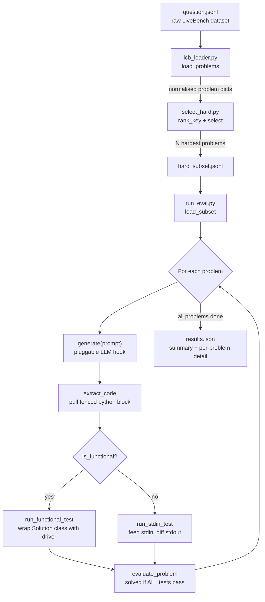

# Bootcamp Eval — LiveBench Code-Gen Harness

## What is this? (~100 words)

This is a small, stdlib-only evaluation harness for stress-testing a code-generation
pipeline (e.g. an LLM-based coding orchestrator) against **hard** competitive
programming problems from LiveBench's `LCB_generation` dataset (LeetCode / AtCoder).
It loads and normalizes the raw dataset, selects the N hardest problems, sends each
problem's prompt to a pluggable `generate()` function, extracts the returned Python
code, runs it against every public + private test case in an isolated subprocess
with a timeout, and reports PASS/FAIL per problem plus an overall score. Results are
written to `results.json` for later inspection.

## Files

- `question.jsonl` — raw LiveBench dataset (not committed in full pipeline path;
  see `lcb_loader.py` for expected location/schema).
- `lcb_loader.py` — parses and normalizes the raw dataset into a flat dict per problem.
- `select_hard.py` — ranks and picks the N hardest problems, writes `hard_subset.jsonl`.
- `run_eval.py` — runs the generation + grading pipeline against the selected subset,
  writes `results.json`.

## Pipeline Flow



## Function Reference

### `lcb_loader.py`
| Function | Purpose |
|---|---|
| `_decode_private(raw)` | Decodes private test cases: base64 → zlib → pickle → list. |
| `_decode_tests(raw)` | Decodes public test cases (plain JSON) or falls back to private decoding. |
| `_parse_original_json(q)` | Extracts the nested `original_json` field (sometimes a JSON string). |
| `_parse_metadata(oj)` | Extracts `metadata` (function name, etc.) from `original_json`. |
| `_extract_prompt(q, oj)` | Builds the full problem statement from `turns` or `question_content`. |
| `load_problems(path)` | **Public API.** Reads the dataset JSONL and returns a list of normalized problem dicts (`question_id`, `title`, `platform`, `prompt`, `difficulty`, `fn_name`, `tests`, etc.). |

### `select_hard.py`
| Function | Purpose |
|---|---|
| `rank_key(p)` | Sort key: `hard` difficulty first, then by test count + prompt length (proxy for difficulty). |
| `select(problems, n, include_atcoder)` | Filters (LeetCode-only by default) and returns the top-N hardest problems. |
| `write_subset(problems, path)` | Writes the chosen problems to a JSONL subset file. |
| `main()` | CLI entry point — wires args → `load_problems` → `select` → `write_subset`. |

### `run_eval.py`
| Function | Purpose |
|---|---|
| `generate(prompt)` | **The one pluggable hook.** Default: calls an OpenAI-compatible chat endpoint (env vars `MODEL_API_BASE`, `MODEL_NAME`, `MODEL_API_KEY`). Swap this for a direct call into a real orchestrator's `solve(prompt)`. |
| `extract_code(text)` | Pulls the generated program out of a model reply (prefers the longest fenced ```python block). |
| `run_stdin_test(py, prog_path, test, timeout)` | Runs a "stdin" test: feeds input via stdin, compares whitespace-normalized stdout. |
| `run_functional_test(py, driver_path, test, exp_path, timeout)` | Runs a "functional" test: wraps the generated `Solution` class in a driver, compares the return value. |
| `evaluate_problem(p, code, timeout, max_tests)` | Runs all tests for one problem in a subprocess; a problem is `solved` only if **every** test passes. |
| `load_subset(path)` | Reads the JSONL subset produced by `select_hard.py`. |
| `main()` | CLI entry point — loads subset, calls `generate()` + `evaluate_problem()` per problem, prints PASS/FAIL, writes `results.json`. |
| `_meta(p)` | Extracts the small set of metadata fields stored alongside each result. |

## Usage

```bash
# 1. Pick the hard subset
python select_hard.py --n 5
python select_hard.py --n 8 --include-atcoder

# 2. Point the default generate() hook at a model server
set MODEL_API_BASE=http://localhost:8000/v1
set MODEL_NAME=gemma-4
set MODEL_API_KEY=sk-anything

# 3. Run the eval
python run_eval.py
python run_eval.py --subset hard_subset.jsonl --timeout 10
python run_eval.py --max-tests 5   # quick smoke run
```

## What's Missing / Not Yet in This Repo

- **The actual `livebench` dataset directory** (`livebench/data/live_bench/coding/LCB_generation/question.jsonl`)
  is the default source path referenced by `lcb_loader.py` / `select_hard.py`, but
  there's no `livebench/` folder in this repo — only a top-level `question.jsonl`.
  Need to confirm which path is actually expected/used, or fetch/clone the
  LiveBench dataset.
- **The student orchestrator itself.** `run_eval.py`'s `generate()` currently only
  calls a generic OpenAI-compatible endpoint; there is no `orchestrator.py` or
  equivalent module wired in yet (the comment in `run_eval.py` explains the
  intended integration point).
- **`requirements.txt` / dependency manifest.** The `openai` package is required
  for the default hook but isn't pinned anywhere.
- **No automated tests** for the harness itself (`lcb_loader.py`, `select_hard.py`,
  `run_eval.py` have no unit tests).
- **No `hard_subset.jsonl` or `results.json` committed** — these are generated
  artifacts, so a first-time run requires executing the pipeline end-to-end before
  any output exists.
- **No CI / lint config** (no `.github/workflows`, no `pyproject.toml`, etc.).
- **No license or contribution docs.**
